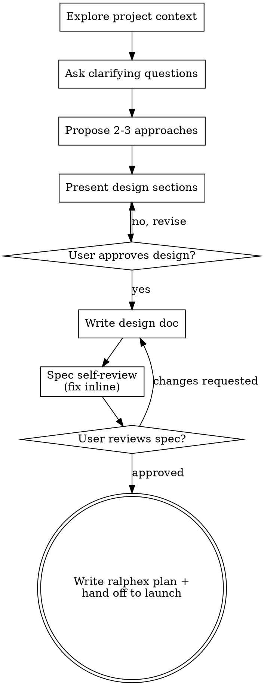

# Brainstorming Ideas Into Designs

Help turn ideas into fully formed designs and specs through natural collaborative dialogue.

Start by understanding the current project context, then ask questions one at a time to refine the idea. Once you understand what you're building, present the design and get user approval.

<HARD-GATE>
Do NOT invoke any implementation skill, write any code, scaffold any project, or take any implementation action until you have presented a design and the user has approved it. This applies to EVERY project regardless of perceived simplicity.
</HARD-GATE>

## Anti-Pattern: "This Is Too Simple To Need A Design"

Every project goes through this process. A todo list, a single-function utility, a config change — all of them. "Simple" projects are where unexamined assumptions cause the most wasted work. The design can be short (a few sentences for truly simple projects), but you MUST present it and get approval.

## Checklist

You MUST create a task for each of these items and complete them in order:

1. **Explore project context** — check files, docs, recent commits
2. **Ask clarifying questions** — one at a time, understand purpose/constraints/success criteria
3. **Propose 2-3 approaches** — with trade-offs and your recommendation
4. **Present design** — in sections scaled to their complexity, get user approval after each section
5. **Write design doc** — save to `docs/plans/YYYY-MM-DD-<topic>-design.md` and commit
6. **Spec self-review** — quick inline check for placeholders, contradictions, ambiguity, scope (see below)
7. **User reviews written spec** — ask user to review the spec file before proceeding
8. **Write the ralphex plan** — translate the approved design into a ralphex-format plan at `docs/plans/YYYY-MM-DD-<topic>-plan.md`, then hand off to the user to launch ralphex (see "After the Design")

## Process Flow



**The terminal state is writing a ralphex plan and handing off to the user to launch it.** Do NOT invoke any other implementation skill, and do NOT try to launch ralphex yourself — ralphex cannot run nested inside Claude Code (it spawns its own Claude sessions), so it MUST be launched by the user from a regular terminal.

## The Process

**Understanding the idea:**

- Check out the current project state first (files, docs, recent commits)
- Before asking detailed questions, assess scope: if the request describes multiple independent subsystems (e.g., "build a platform with chat, file storage, billing, and analytics"), flag this immediately. Don't spend questions refining details of a project that needs to be decomposed first.
- If the project is too large for a single spec, help the user decompose into sub-projects: what are the independent pieces, how do they relate, what order should they be built? Then brainstorm the first sub-project through the normal design flow. Each sub-project gets its own spec → plan → ralphex run cycle.
- For appropriately-scoped projects, ask questions one at a time to refine the idea
- Prefer multiple choice questions when possible, but open-ended is fine too
- Only one question per message - if a topic needs more exploration, break it into multiple questions
- Focus on understanding: purpose, constraints, success criteria

**Exploring approaches:**

- Propose 2-3 different approaches with trade-offs
- Present options conversationally with your recommendation and reasoning
- Lead with your recommended option and explain why

**Presenting the design:**

- Once you believe you understand what you're building, present the design
- Scale each section to its complexity: a few sentences if straightforward, up to 200-300 words if nuanced
- Ask after each section whether it looks right so far
- Cover: architecture, components, data flow, error handling, testing
- Be ready to go back and clarify if something doesn't make sense

**Design for isolation and clarity:**

- Break the system into smaller units that each have one clear purpose, communicate through well-defined interfaces, and can be understood and tested independently
- For each unit, you should be able to answer: what does it do, how do you use it, and what does it depend on?
- Can someone understand what a unit does without reading its internals? Can you change the internals without breaking consumers? If not, the boundaries need work.
- Smaller, well-bounded units are also easier for you to work with - you reason better about code you can hold in context at once, and your edits are more reliable when files are focused. When a file grows large, that's often a signal that it's doing too much.

**Working in existing codebases:**

- Explore the current structure before proposing changes. Follow existing patterns.
- Where existing code has problems that affect the work (e.g., a file that's grown too large, unclear boundaries, tangled responsibilities), include targeted improvements as part of the design - the way a good developer improves code they're working in.
- Don't propose unrelated refactoring. Stay focused on what serves the current goal.

## After the Design

**Documentation:**

- Write the validated design (spec) to `docs/plans/YYYY-MM-DD-<topic>-design.md`
  - (User preferences for spec location override this default)
- Commit the design document to git

**Spec Self-Review:**
After writing the spec document, look at it with fresh eyes:

1. **Placeholder scan:** Any "TBD", "TODO", incomplete sections, or vague requirements? Fix them.
2. **Internal consistency:** Do any sections contradict each other? Does the architecture match the feature descriptions?
3. **Scope check:** Is this focused enough for a single implementation plan, or does it need decomposition?
4. **Ambiguity check:** Could any requirement be interpreted two different ways? If so, pick one and make it explicit.

Fix any issues inline. No need to re-review — just fix and move on.

**User Review Gate:**
After the spec review loop passes, ask the user to review the written spec before proceeding:

> "Spec written and committed to `<path>`. Please review it and let me know if you want to make any changes before we turn it into a ralphex plan."

Wait for the user's response. If they request changes, make them and re-run the spec review loop. Only proceed once the user approves.

## Implementation Hand-off (ralphex)

Once the spec is approved, translate it into a **ralphex-format plan file** — this is the terminal step. Do NOT write any implementation code yourself; ralphex executes the plan.

**1. Write the plan** to `docs/plans/YYYY-MM-DD-<topic>-plan.md` in ralphex's required format:

```markdown
One-line description of the goal.

## Context
Background from the approved spec the agent needs. Reference the design doc path
(`docs/plans/YYYY-MM-DD-<topic>-design.md`) and the specific files involved.

## Tasks

### Task 1: Short title
- [ ] Specific implementation step
- [ ] Write/extend tests for the above

### Task 2: Next piece of work
- [ ] Steps here

## Constraints
- Things the agent must NOT do (scope guards from the design)
- Project conventions it must follow (e.g. `nix fmt`, `nix flake check`, Tailscale wrapper pattern)
```

Ralphex plan-file rules (these are hard requirements — getting them wrong means ralphex finds no work):

- Checkboxes MUST be `- [ ]` **inside** `### Task N:` sections.
- Each Task ≈ one Claude session (10–30 min of work). Split anything bigger.
- Put test requirements inside each task.
- The **first line is the goal** — make it descriptive.
- The **Constraints section is critical** — carry the design's scope guards and "do NOT" rules here.
- Reference the specific files each task touches.

**2. Commit the plan** to git alongside the design doc.

**3. Hand off to the user.** End your turn telling the user to launch ralphex themselves from a regular terminal (NOT inside Claude Code):

> "Plan written and committed to `docs/plans/<file>-plan.md`. Ralphex can't run nested inside Claude Code, so launch it from a normal terminal:
>
> ```bash
> ralphex docs/plans/<file>-plan.md --tasks-only --session-timeout=30m --idle-timeout=5m --wait=1h
> ```
>
> Run `ralphex --help` first to confirm flags. Drop `--tasks-only` to also run the multi-pass review phases. Monitor with `tail -f .ralphex/progress/progress-*.txt`."

Do NOT invoke any other skill, and do NOT attempt to run `ralphex` via the Bash tool — it will fail with a nested-Claude error. The ralphex plan file is the deliverable; launching it is the user's step. (See the `ralphex` skill for monitoring, parallel execution, and troubleshooting.)

## Key Principles

- **One question at a time** - Don't overwhelm with multiple questions
- **Multiple choice preferred** - Easier to answer than open-ended when possible
- **YAGNI ruthlessly** - Remove unnecessary features from all designs
- **Explore alternatives** - Always propose 2-3 approaches before settling
- **Incremental validation** - Present design, get approval before moving on
- **Be flexible** - Go back and clarify when something doesn't make sense
- **Design → spec → ralphex plan → user launches** - never code directly from this skill
